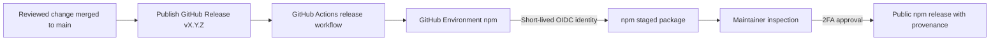

# Release architecture and maintainer guide

This project publishes to npm without storing an npm write token in GitHub.
GitHub Actions authenticates to npm through OpenID Connect (OIDC), stages the
package, and leaves the final publication decision to a human maintainer using
two-factor authentication (2FA).

This document describes the public release architecture and the steps a
maintainer follows. It intentionally contains no credentials, one-time
passwords, recovery codes, session data, or secret values.

## Architecture



The release boundary has five parts:

1. **GitHub Release:** Publishing a GitHub Release triggers the workflow. A
   standalone tag push does not publish anything.
2. **GitHub Environment:** The workflow job uses Environment `npm`, restricted
   to selected `v*` tags. The Environment contains no npm credential.
3. **GitHub OIDC:** The job receives `id-token: write` permission and requests a
   short-lived identity for this workflow run.
4. **npm trusted publisher:** npm accepts `npm stage publish` only when the
   repository, workflow filename, and Environment match its configured trust
   relationship.
5. **Human approval:** Approval happens on npm, not GitHub. After the workflow
   succeeds, a maintainer opens npmjs.com's **Staged Packages** view or uses the
   authenticated npm CLI, inspects the stage, and approves it with npm 2FA.

Trusted publication from this public GitHub repository automatically creates
npm provenance. The workflow does not need `--provenance` and does not use
`NODE_AUTH_TOKEN`, `NPM_TOKEN`, or another long-lived registry secret.

## Public release configuration

| Setting | Value |
| --- | --- |
| npm package | `fastify-observability` |
| GitHub repository | `janisto/fastify-observability` |
| Workflow | `.github/workflows/release.yml` |
| GitHub Environment | `npm` |
| Workflow trigger | GitHub Release `published` |
| Trusted action | `npm stage publish` only |
| Release notes | GitHub-generated and maintainer-reviewed |
| Stable GitHub Release label | `Latest` |
| Stable npm dist-tag | `latest` |
| Prerelease npm dist-tag | `next` |

The npm trusted-publisher form uses the workflow filename `release.yml`, not
the full `.github/workflows/release.yml` path. All identity fields are
case-sensitive.

## What the workflow does

The workflow deliberately stays close to npm's official trusted-publishing
example:

1. checks out the explicit GitHub Release tag without persisting credentials;
2. installs pnpm and the latest Node 24 release;
3. verifies that the tag matches `package.json.version` and that the release
   commit belongs to `main`;
4. configures the public npm registry with `actions/setup-node`;
5. installs dependencies from the frozen pnpm lockfile;
6. runs `pnpm qa`, including build and tests;
7. creates the npm tarball, verifies its exact contents, installs it with the
   minimum supported Fastify in an isolated consumer, typechecks the public
   declarations, and exercises a real request through the installed package;
8. records the inspected tarball's SHA-256 hash;
9. stages that exact tarball using `npm stage publish` and OIDC.

Normal GitHub Releases stage with npm dist-tag `latest`. GitHub Releases marked
as prereleases stage with `next`; the GitHub prerelease checkbox must therefore
match the package's SemVer version.

The workflow does not update npm globally. The latest Node 24 release includes
an npm version new enough for OIDC and staged publishing.

## Maintainer release guide

### 1. Prepare the version

Create a normal review branch and:

1. update `package.json.version`;
2. add the release date and user-visible changes to `CHANGELOG.md`;
3. update documentation for any public API or structured-field change;
4. update `pnpm-lock.yaml` only when the reviewed package metadata requires it.

Do not create the Git tag during version preparation. Version, changelog, code,
and documentation must be reviewed together.

### 2. Run the release checks

```bash
just install
just package-check
just audit
actionlint .github/workflows/ci.yml .github/workflows/release.yml
git diff --check
```

`just package-check` removes `dist/`, runs the complete `pnpm qa` gate, creates
the exact npm tarball under `artifacts/`, and verifies its fixed file set.
It then installs that tarball with Fastify 5.10.0 in a temporary consumer,
typechecks the public declarations with strict TypeScript, and runs the public
plugin through a real correlated GCP request and terminal access record.
Cleaning `dist/` prevents files from deleted or renamed source modules from
surviving a local rebuild. The artifact check rejects source maps and anything
outside the compiled JavaScript, declarations, README, changelog, license, and
package metadata.

The release workflow intentionally continues to invoke pnpm directly. GitHub
Actions starts from a fresh checkout, while the Justfile is the maintainer-facing
local workflow and cleanup layer.

Merge the release preparation through a green pull request to `main`.

### 3. Publish the GitHub Release

From the repository's GitHub Releases page:

1. create a draft release;
2. create the tag `vX.Y.Z`, where `X.Y.Z` exactly matches
   `package.json.version`;
3. target the exact reviewed commit on `main`;
4. use `vX.Y.Z` as the title;
5. click **Generate release notes**;
6. review the generated previous tag, merged pull requests, contributors, and
   full-changelog link, then edit only for accuracy and clarity; ensure the
   user-visible changes agree with `CHANGELOG.md`;
7. for a stable version, leave **This is a pre-release** cleared and select
   **Set as latest release**;
8. review the tag, target commit, title, generated notes, and release labels,
   then publish the release.

The only exception to the Latest rule is a SemVer prerelease. For a prerelease,
select **This is a pre-release** and do not select **Set as latest release**;
the workflow stages it with npm dist-tag `next` instead of replacing the stable
GitHub Latest release or npm `latest` dist-tag.

The equivalent draft-first GitHub CLI flow is:

```bash
VERSION="$(node -p "require('./package.json').version")"
git fetch origin main
TARGET="$(git rev-parse origin/main)"

gh release create "v$VERSION" \
  --target "$TARGET" \
  --title "v$VERSION" \
  --generate-notes \
  --latest \
  --fail-on-no-commits \
  --draft

gh release view "v$VERSION" --web
```

Before creating the draft, verify that `TARGET` is the exact reviewed commit
that should be released. Do not use a newer unreviewed `main` commit merely
because it is currently at the branch tip.

After reviewing the draft in the browser, publish the unchanged stable release
and explicitly preserve its Latest label:

```bash
gh release edit "v$VERSION" --draft=false --latest
```

For a SemVer prerelease, replace `--latest` in the create command with
`--prerelease --latest=false`, and publish it with
`--draft=false --prerelease --latest=false`.

Do not push the release tag separately. The published GitHub Release is the
authorization event, and release immutability locks its tag and release assets.

### 4. Confirm npm staging

Open the GitHub Actions run named **Publish to npm**. It must finish successfully
without an npm token or manual 2FA prompt.

The stage appears only after this workflow succeeds. Sign in to npmjs.com as an
npm maintainer, open the **Staged Packages** view, and select the staged
`fastify-observability` version. If no workflow has staged a version, there is
nothing to approve.

An authenticated maintainer can inspect the same stage with the npm CLI:

```bash
npm stage list fastify-observability
npm stage view <stage-id>
npm stage download <stage-id>
```

Check the package name, version, dist-tag, file list, integrity, repository,
workflow identity, and provenance. Compare the staged package with the reviewed
GitHub Release.

### 5. Approve with 2FA

Approve only after the stage is exact. On npmjs.com, click **Approve** for the
selected staged package and complete the interactive 2FA prompt. Alternatively,
approve through the authenticated npm CLI:

```bash
npm stage approve <stage-id>
```

Use the interactive npm or website prompt for 2FA. Never place an OTP, recovery
code, password, or session token in a command, file, issue, release note, CI
variable, or log.

Approval makes the staged version public. npm versions are immutable and cannot
be overwritten.

### 6. Verify the public release

Set the released version locally and inspect public metadata:

```bash
VERSION=X.Y.Z
npm view "fastify-observability@$VERSION" \
  name version dist-tags repository engines peerDependencies dependencies \
  maintainers dist --json
```

Verify that stable releases update `latest`, prereleases update `next`, and no
unexpected maintainer or dependency appears.

In a fresh Node 24 directory, install from the public registry:

```bash
pnpm add fastify@5.10.0 "fastify-observability@$VERSION"
```

Run the README's GCP setup and a TypeScript typecheck. Repeat with the latest
compatible Fastify 5 version when validating a stable release.

Finally, verify:

- the npm package page shows provenance for the release;
- provenance points to this repository and `release.yml`;
- the GitHub Release tag points to the reviewed commit;
- a stable GitHub Release carries the **Latest** label;
- the GitHub Release is marked immutable;
- the changelog and published package behavior agree.

`npm audit signatures` should run in a separate temporary npm-managed project.
Do not create or commit `package-lock.json` in this pnpm repository.

## Failure and recovery

- **OIDC reports `E404`:** Check the npm trusted publisher's owner, repository,
  workflow filename, Environment, and stage-only permission. Check that the job
  has `id-token: write`. Do not add a token fallback.
- **The workflow fails before staging:** No npm version was published. A purely
  transient run may be retried against the unchanged release. A source or
  workflow correction requires a new reviewed version and GitHub Release.
- **The stage is wrong:** Do not approve it. Reject it with 2FA, correct the
  release, and follow npm's staged-version rules.
- **A public release is defective:** Deprecate it when appropriate and publish
  a corrected higher version. Never reuse or overwrite the version.
- **Provenance is missing:** Treat the release as incomplete. Verify trusted
  OIDC publication, public repository visibility, and the exact workflow
  identity before claiming provenance.

## Bootstrap history

`0.1.0` was a one-time metadata-only bootstrap used to create the npm package
record. It was published interactively and therefore has no GitHub Actions
provenance. `0.2.0` is the first implementation release intended to use this
OIDC staging architecture.

## Official documentation

- [npm trusted publishing](https://docs.npmjs.com/trusted-publishers/)
- [npm staged publishing](https://docs.npmjs.com/staged-publishing/)
- [`npm stage` CLI](https://docs.npmjs.com/cli/v11/commands/npm-stage/)
- [npm provenance](https://docs.npmjs.com/generating-provenance-statements/)
- [`actions/setup-node` trusted-publisher guide](https://github.com/actions/setup-node/blob/main/docs/advanced-usage.md#publishing-to-npm-with-trusted-publisher-oidc)
- [GitHub OIDC](https://docs.github.com/en/actions/reference/security/oidc)
- [GitHub deployment environments](https://docs.github.com/en/actions/concepts/workflows-and-actions/deployment-environments)
- [GitHub Release workflow events](https://docs.github.com/en/actions/reference/workflows-and-actions/events-that-trigger-workflows#release)
- [GitHub releases](https://docs.github.com/en/repositories/releasing-projects-on-github)
- [GitHub immutable releases](https://docs.github.com/en/code-security/concepts/supply-chain-security/immutable-releases)
